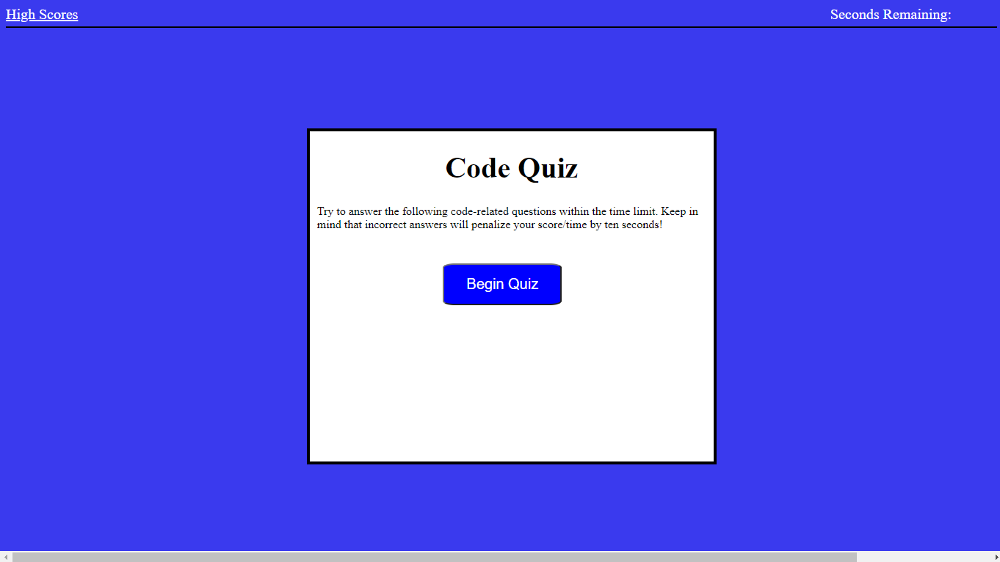

# code-quiz
### Test your code knowladge with this timed multiple choice quiz!

# Introuction 

### To begin just click the "Begin Quiz" button.  From there you will be asked a series of questions.  You will be given 60 seconds to complete the quiz.  When you select an answer you will be told if you are correct or incorrect before moving to the next quesion.  If you are incorrect 10 seconds will be removed from the seconds remaining.  When you are finished or the timer gets to 0 the quiz will end.  Your score will be equal to the time left on the clock, and you can enter you initials. You can clear the scores or go back and take the quiz again!!

# Technologies 

* HTML
* CSS
* JavaScript

# Deployment

* https://github.com/oconnor97/code-quiz

* https://oconnor97.github.io/code-quiz/

